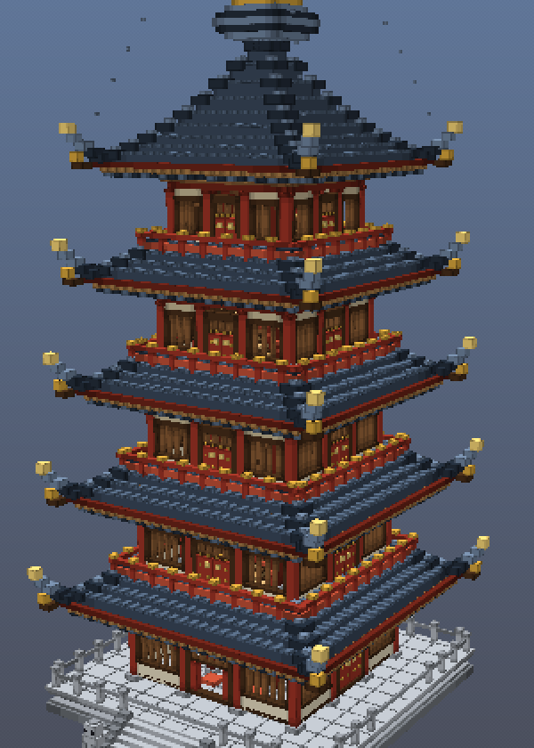

使用deepseek灰测模型一轮对话做出，提示词：帮我生成一个单独的中国古代风格木制高塔，精致像素风格，内构结构完整符合显示情况，同时得是3d的，html网页查看，有透视功能能够看见内部。耗时70分钟，36token/s，所耗费用在5元左右。部分思维链（I need to keep the implementation manageable—a single HTML file around 1000+ lines is workable. For the geometry, I'm thinking in terms of a voxel grid where each unit represents a pixel block, with the tower base around 20 units wide and 60 units tall. I'll create a helper function that snaps boxes to this grid for a pixelated voxel aesthetic, using flat-shaded materials with a limited color palette of wood tones—dark wood, medium wood, and light wood shades.

Now I'm defining the color scheme: vermillion red for columns and railings, gray-blue or jade green for roof tiles, stone gray for the base, gold for the finial, and off-white for walls. The structure will have five stories plus a base and finial, with each story tapering slightly as it rises—the width shrinking by about 12% per level. Each story consists of corner columns and mid-side columns in red, arranged in a grid pattern with a cross-section of 1x1 units.

I'm adding the central mast running continuously through all stories with a 2x2 cross-section in wood color, floor slabs made of alternating planks with a stairwell opening, horizontal beams connecting the columns, stepped dougong blocks at the eaves, and a pyramidal roof structure for each story with tiled rows and upturned corner blocks.）

# 释迦木塔 · 像素体素 3D 剖视

一座**中国古代楼阁式木塔**（仿辽·应县木塔形制）的精致像素风 3D 网页模型。
零依赖、离线可用 —— 双击 `index.html` 即可在浏览器中查看、旋转、并**透视看到塔内完整构架**。



### 实拍截图（页面实际导出的 PNG）

| 截图 | 说明 |
| --- | --- |
| [木塔像素剖视_1787234248449.png](screenshots/木塔像素剖视_1787234248449.png) | 实体外观（像素粒度 3×） |
| [木塔像素剖视_1787234333511.png](screenshots/木塔像素剖视_1787234333511.png) | 半剖透视（剖切面斜切） |
| [木塔像素剖视_1787234372809.png](screenshots/木塔像素剖视_1787234372809.png) | X 光透视（外壳半透明） |
| [木塔像素剖视_1787234414954.png](screenshots/木塔像素剖视_1787234414954.png) | 层展爆炸视图 |
| [50687c15-6198-4ac7-adc7-6c5bbe8845f7.png](screenshots/50687c15-6198-4ac7-adc7-6c5bbe8845f7.png) | 全屏外观抓图（另存） |
| [a40815a6-3f44-4b1e-a5e1-099860b5b84f.png](screenshots/a40815a6-3f44-4b1e-a5e1-099860b5b84f.png) | 全屏透视抓图（另存） |

---

## 一、打开方式

直接双击 `index.html`（或拖进浏览器）即可。

- **无需联网、无需服务器、无需安装**：全部代码为本地原生 JavaScript + WebGL2，未引用任何 CDN。
- 要求浏览器支持 **WebGL2**（Chrome / Edge / Firefox / Safari 15+ 均可）。
- 若需通过本地服务器打开：`python -m http.server` 后访问 `http://localhost:8000/`。

## 二、透视方式（看见内部）

| 模式 | 效果 |
| --- | --- |
| **实体** | 正常外观。注意次间为**直棂窗**（棂条之间留空），当心间正门敞开，本身即可窥见塔内佛像与塔心柱 |
| **X 光** | 台基、墙体、瓦顶、勾栏、塔刹变半透明（透明度可调），柱额、梁架、楼板、楼梯、佛像保持实体 |
| **半剖** | 任意角度的竖向剖切面（转角 0–360°、进深可推拉）。默认只剖"外壳"，勾选*剖及内构*则连楼板梁架一并剖开，成为真正的建筑剖面图 |
| **层展** | 各层沿塔心柱竖向拉开（爆炸视图），逐层结构一目了然 |

另有 **楼层聚焦**：选定某层后自动做水平剖切（切去该层以上部分），可俯视该层内部；
**进入塔内**把相机放到该层室内，配合自动环绕即成室内漫游。

## 三、操作

| 操作 | 说明 |
| --- | --- |
| 左键拖动 | 环绕旋转 |
| 滚轮 | 远近缩放 |
| 右键 / Shift + 拖动 | 平移 |
| 双指 | 触屏缩放 |
| `1` `2` `3` `4` | 切换 实体 / X光 / 半剖 / 层展 |
| `5`–`9` | 聚焦一至五层 |
| `0` | 复位视角 |
| `Q` / `W` | 屋顶 / 墙体 显隐 |
| `空格` | 自动环绕开关 |

面板还可调：像素粒度（1×–6×）、体素勾线强度、深度描边、昼夜（含像素云与星空）、构件显隐图例、构件标注、存为 PNG。

## 四、模型的形制与内部结构

塔身共 **五层**，方形平面，逐层收分；全塔 **6 700 余个体素方块**，按构件分类建模：

**外部（自下而上）**
- **须弥座台基**：圭角、下枋、束腰（壸门）、上枋、台面石、石栏杆望柱；正面踏跺（台阶）、垂带、两侧石狮
- **柱额**：每面三开间 —— 角柱 + 补间柱，柱础、檐柱、阑额、普拍枋、地栿
- **斗拱**：转角铺作 4 朵 + 补间铺作 8 朵／层，含栌斗、华拱、泥道拱、令拱、下昂、散斗、替木
- **腰檐**：撩檐枋、檐椽、飞子、瓦当滴水、板瓦、筒瓦垄、戗脊、**翼角起翘（飞檐）**、套兽、角梁、檐角风铃
- **平座勾栏**：承重枋、挑梁、平座地板、地栿、华板、寻杖扶手、望柱及望柱头
- **墙身**：当心间板门（门框立颊、门额、门砧、门钉、铺首衔环、横披窗）；次间**直棂窗** + 槛墙 + 抹灰墙；一层正门敞开并悬匾额
- **塔刹**：覆钵、仰莲盘、刹杆、七重相轮、宝盖垂铃、水烟、宝珠、四角铁链

**内部（完整可通行）**
- **塔心柱**：3×3 断面自地面贯通至塔刹，每半层设铁箍
- **双层柱网**：外槽檐柱 + 内槽柱，内额相联
- **梁架**：四椽栿大梁架于内槽柱之上、井字次梁、襻间枋、角替斜撑；顶层设**藻井**与明镜垂莲柱
- **楼板**：楼板 + 楞木（次梁），按塔心柱与楼梯井**精确开洞**
- **木楼梯**：每层一跑 15 级（踏板、帮板、望柱、扶手、下槛、上口平台），置于外槽走道，**逐层转向**
- **陈设**：一层佛坛 + 释迦坐像（莲座、趺坐、佛首、肉髻、火焰背光）+ 供桌香炉烛台蒲团；上层佛龛、小佛像、藏经柜（经卷）、经案；各层悬宫灯

**几何自洽性由脚本强制校验**（见下）：楼梯上口与上层楼板严格齐平、必须落在楼梯井洞口之内、末段不被楼板封顶、踏板上方 ≈1.75 m 内无梁柱侵占、栏杆与陈设下方必须有实铺楼板、楼板不与塔心柱相冲。楼梯转向与陈设朝向由程序**自动搜索避让**，不是手工摆放。

## 五、文件

| 文件 | 说明 |
| --- | --- |
| `index.html` | 页面与控制面板 |
| `app.js` | 原生 WebGL2 渲染器：合并顶点缓冲、量化平行光 + 体素面边勾线、低分辨率离屏渲染 + NEAREST 放大 + 深度描边、天空/像素云/星空、剖切与透明、相机与交互 |
| `pagoda-model.js` | **纯 JS 塔体生成器**（无依赖，浏览器/Node 通用）：输出带构件名的方块清单 |
| `tools/render-preview.js` | Node 软件光栅化预览 + **结构自检**（输出 PNG 到 `preview/`，并打印楼梯/楼板/悬空/塔心柱校验） |
| `tools/headless-test.js` | mock DOM + mock WebGL2 的**无头测试**：实跑 `app.js` 30 帧并模拟全部 UI 交互，校验 uniform／顶点属性／varying 一致性与取景 |

自检与预览：

```bash
node tools/render-preview.js              # 结构自检 + 生成 preview/*.png
node tools/render-preview.js b-cutaway:kind   # 以字符图查看剖面（kind / level / roof / lum）
node tools/headless-test.js               # 无头渲染与交互测试
```

## 六、改造

塔的比例集中在 `pagoda-model.js` 顶部 `buildPagoda()` 的 `cfg`：

```js
levels: 5,                               // 层数
halfWall: [18, 16.5, 15, 13.5, 12],      // 各层檐柱中线半宽（收分）
eaveOut: 8,                              // 出檐深度
wallH: 11,                               // 檐柱高
storyPitch: 20,                          // 层高
baseH: 5, colS: 1.5,                     // 台基高、柱径
```

改后重跑 `node tools/render-preview.js`，自检会立即指出楼梯净空、洞口对位等是否仍成立。
调色板见同文件 `P`，构件分类见 `KINDS`（分类决定它在透视模式中算"外壳"还是"内构"）。
